### Questions
* find questions on the google doc

### Objectives
YWBAT 
* find specific data using .loc and iloc 
* create new columns in a dataframe
* use the apply and map functions on a dataframe
* iterate through a dataframe using the column names


### Best Practices
* when opening a file in python, always close it

### Outline


```python
import pandas as pd
import numpy as np


from sklearn.datasets import load_breast_cancer

import matplotlib.pyplot as plt
```


```python
d = load_breast_cancer()
```


```python
d['data']
```


    array([[1.799e+01, 1.038e+01, 1.228e+02, ..., 2.654e-01, 4.601e-01,
            1.189e-01],
           [2.057e+01, 1.777e+01, 1.329e+02, ..., 1.860e-01, 2.750e-01,
            8.902e-02],
           [1.969e+01, 2.125e+01, 1.300e+02, ..., 2.430e-01, 3.613e-01,
            8.758e-02],
           ...,
           [1.660e+01, 2.808e+01, 1.083e+02, ..., 1.418e-01, 2.218e-01,
            7.820e-02],
           [2.060e+01, 2.933e+01, 1.401e+02, ..., 2.650e-01, 4.087e-01,
            1.240e-01],
           [7.760e+00, 2.454e+01, 4.792e+01, ..., 0.000e+00, 2.871e-01,
            7.039e-02]])


```python
d['feature_names']
```


    array(['mean radius', 'mean texture', 'mean perimeter', 'mean area',
           'mean smoothness', 'mean compactness', 'mean concavity',
           'mean concave points', 'mean symmetry', 'mean fractal dimension',
           'radius error', 'texture error', 'perimeter error', 'area error',
           'smoothness error', 'compactness error', 'concavity error',
           'concave points error', 'symmetry error',
           'fractal dimension error', 'worst radius', 'worst texture',
           'worst perimeter', 'worst area', 'worst smoothness',
           'worst compactness', 'worst concavity', 'worst concave points',
           'worst symmetry', 'worst fractal dimension'], dtype='<U23')


```python
df = pd.DataFrame(data=d['data'], columns=d['feature_names'])
df.head()
```


<div>
<style scoped>
    .dataframe tbody tr th:only-of-type {
        vertical-align: middle;
    }

    .dataframe tbody tr th {
        vertical-align: top;
    }

    .dataframe thead th {
        text-align: right;
    }
</style>
<table border="1" class="dataframe">
  <thead>
    <tr style="text-align: right;">
      <th></th>
      <th>mean radius</th>
      <th>mean texture</th>
      <th>mean perimeter</th>
      <th>mean area</th>
      <th>mean smoothness</th>
      <th>mean compactness</th>
      <th>mean concavity</th>
      <th>mean concave points</th>
      <th>mean symmetry</th>
      <th>mean fractal dimension</th>
      <th>...</th>
      <th>worst radius</th>
      <th>worst texture</th>
      <th>worst perimeter</th>
      <th>worst area</th>
      <th>worst smoothness</th>
      <th>worst compactness</th>
      <th>worst concavity</th>
      <th>worst concave points</th>
      <th>worst symmetry</th>
      <th>worst fractal dimension</th>
    </tr>
  </thead>
  <tbody>
    <tr>
      <td>0</td>
      <td>17.99</td>
      <td>10.38</td>
      <td>122.80</td>
      <td>1001.0</td>
      <td>0.11840</td>
      <td>0.27760</td>
      <td>0.3001</td>
      <td>0.14710</td>
      <td>0.2419</td>
      <td>0.07871</td>
      <td>...</td>
      <td>25.38</td>
      <td>17.33</td>
      <td>184.60</td>
      <td>2019.0</td>
      <td>0.1622</td>
      <td>0.6656</td>
      <td>0.7119</td>
      <td>0.2654</td>
      <td>0.4601</td>
      <td>0.11890</td>
    </tr>
    <tr>
      <td>1</td>
      <td>20.57</td>
      <td>17.77</td>
      <td>132.90</td>
      <td>1326.0</td>
      <td>0.08474</td>
      <td>0.07864</td>
      <td>0.0869</td>
      <td>0.07017</td>
      <td>0.1812</td>
      <td>0.05667</td>
      <td>...</td>
      <td>24.99</td>
      <td>23.41</td>
      <td>158.80</td>
      <td>1956.0</td>
      <td>0.1238</td>
      <td>0.1866</td>
      <td>0.2416</td>
      <td>0.1860</td>
      <td>0.2750</td>
      <td>0.08902</td>
    </tr>
    <tr>
      <td>2</td>
      <td>19.69</td>
      <td>21.25</td>
      <td>130.00</td>
      <td>1203.0</td>
      <td>0.10960</td>
      <td>0.15990</td>
      <td>0.1974</td>
      <td>0.12790</td>
      <td>0.2069</td>
      <td>0.05999</td>
      <td>...</td>
      <td>23.57</td>
      <td>25.53</td>
      <td>152.50</td>
      <td>1709.0</td>
      <td>0.1444</td>
      <td>0.4245</td>
      <td>0.4504</td>
      <td>0.2430</td>
      <td>0.3613</td>
      <td>0.08758</td>
    </tr>
    <tr>
      <td>3</td>
      <td>11.42</td>
      <td>20.38</td>
      <td>77.58</td>
      <td>386.1</td>
      <td>0.14250</td>
      <td>0.28390</td>
      <td>0.2414</td>
      <td>0.10520</td>
      <td>0.2597</td>
      <td>0.09744</td>
      <td>...</td>
      <td>14.91</td>
      <td>26.50</td>
      <td>98.87</td>
      <td>567.7</td>
      <td>0.2098</td>
      <td>0.8663</td>
      <td>0.6869</td>
      <td>0.2575</td>
      <td>0.6638</td>
      <td>0.17300</td>
    </tr>
    <tr>
      <td>4</td>
      <td>20.29</td>
      <td>14.34</td>
      <td>135.10</td>
      <td>1297.0</td>
      <td>0.10030</td>
      <td>0.13280</td>
      <td>0.1980</td>
      <td>0.10430</td>
      <td>0.1809</td>
      <td>0.05883</td>
      <td>...</td>
      <td>22.54</td>
      <td>16.67</td>
      <td>152.20</td>
      <td>1575.0</td>
      <td>0.1374</td>
      <td>0.2050</td>
      <td>0.4000</td>
      <td>0.1625</td>
      <td>0.2364</td>
      <td>0.07678</td>
    </tr>
  </tbody>
</table>
<p>5 rows × 30 columns</p>
</div>


```python
# how do I add the target data as a column to my dataframe? 
df['target'] = d['target']
df.head()
```


<div>
<style scoped>
    .dataframe tbody tr th:only-of-type {
        vertical-align: middle;
    }

    .dataframe tbody tr th {
        vertical-align: top;
    }

    .dataframe thead th {
        text-align: right;
    }
</style>
<table border="1" class="dataframe">
  <thead>
    <tr style="text-align: right;">
      <th></th>
      <th>mean radius</th>
      <th>mean texture</th>
      <th>mean perimeter</th>
      <th>mean area</th>
      <th>mean smoothness</th>
      <th>mean compactness</th>
      <th>mean concavity</th>
      <th>mean concave points</th>
      <th>mean symmetry</th>
      <th>mean fractal dimension</th>
      <th>...</th>
      <th>worst texture</th>
      <th>worst perimeter</th>
      <th>worst area</th>
      <th>worst smoothness</th>
      <th>worst compactness</th>
      <th>worst concavity</th>
      <th>worst concave points</th>
      <th>worst symmetry</th>
      <th>worst fractal dimension</th>
      <th>target</th>
    </tr>
  </thead>
  <tbody>
    <tr>
      <td>0</td>
      <td>17.99</td>
      <td>10.38</td>
      <td>122.80</td>
      <td>1001.0</td>
      <td>0.11840</td>
      <td>0.27760</td>
      <td>0.3001</td>
      <td>0.14710</td>
      <td>0.2419</td>
      <td>0.07871</td>
      <td>...</td>
      <td>17.33</td>
      <td>184.60</td>
      <td>2019.0</td>
      <td>0.1622</td>
      <td>0.6656</td>
      <td>0.7119</td>
      <td>0.2654</td>
      <td>0.4601</td>
      <td>0.11890</td>
      <td>0</td>
    </tr>
    <tr>
      <td>1</td>
      <td>20.57</td>
      <td>17.77</td>
      <td>132.90</td>
      <td>1326.0</td>
      <td>0.08474</td>
      <td>0.07864</td>
      <td>0.0869</td>
      <td>0.07017</td>
      <td>0.1812</td>
      <td>0.05667</td>
      <td>...</td>
      <td>23.41</td>
      <td>158.80</td>
      <td>1956.0</td>
      <td>0.1238</td>
      <td>0.1866</td>
      <td>0.2416</td>
      <td>0.1860</td>
      <td>0.2750</td>
      <td>0.08902</td>
      <td>0</td>
    </tr>
    <tr>
      <td>2</td>
      <td>19.69</td>
      <td>21.25</td>
      <td>130.00</td>
      <td>1203.0</td>
      <td>0.10960</td>
      <td>0.15990</td>
      <td>0.1974</td>
      <td>0.12790</td>
      <td>0.2069</td>
      <td>0.05999</td>
      <td>...</td>
      <td>25.53</td>
      <td>152.50</td>
      <td>1709.0</td>
      <td>0.1444</td>
      <td>0.4245</td>
      <td>0.4504</td>
      <td>0.2430</td>
      <td>0.3613</td>
      <td>0.08758</td>
      <td>0</td>
    </tr>
    <tr>
      <td>3</td>
      <td>11.42</td>
      <td>20.38</td>
      <td>77.58</td>
      <td>386.1</td>
      <td>0.14250</td>
      <td>0.28390</td>
      <td>0.2414</td>
      <td>0.10520</td>
      <td>0.2597</td>
      <td>0.09744</td>
      <td>...</td>
      <td>26.50</td>
      <td>98.87</td>
      <td>567.7</td>
      <td>0.2098</td>
      <td>0.8663</td>
      <td>0.6869</td>
      <td>0.2575</td>
      <td>0.6638</td>
      <td>0.17300</td>
      <td>0</td>
    </tr>
    <tr>
      <td>4</td>
      <td>20.29</td>
      <td>14.34</td>
      <td>135.10</td>
      <td>1297.0</td>
      <td>0.10030</td>
      <td>0.13280</td>
      <td>0.1980</td>
      <td>0.10430</td>
      <td>0.1809</td>
      <td>0.05883</td>
      <td>...</td>
      <td>16.67</td>
      <td>152.20</td>
      <td>1575.0</td>
      <td>0.1374</td>
      <td>0.2050</td>
      <td>0.4000</td>
      <td>0.1625</td>
      <td>0.2364</td>
      <td>0.07678</td>
      <td>0</td>
    </tr>
  </tbody>
</table>
<p>5 rows × 31 columns</p>
</div>


```python
# get 5 point statistics on our dataset
df.describe()
```


<div>
<style scoped>
    .dataframe tbody tr th:only-of-type {
        vertical-align: middle;
    }

    .dataframe tbody tr th {
        vertical-align: top;
    }

    .dataframe thead th {
        text-align: right;
    }
</style>
<table border="1" class="dataframe">
  <thead>
    <tr style="text-align: right;">
      <th></th>
      <th>mean radius</th>
      <th>mean texture</th>
      <th>mean perimeter</th>
      <th>mean area</th>
      <th>mean smoothness</th>
      <th>mean compactness</th>
      <th>mean concavity</th>
      <th>mean concave points</th>
      <th>mean symmetry</th>
      <th>mean fractal dimension</th>
      <th>...</th>
      <th>worst texture</th>
      <th>worst perimeter</th>
      <th>worst area</th>
      <th>worst smoothness</th>
      <th>worst compactness</th>
      <th>worst concavity</th>
      <th>worst concave points</th>
      <th>worst symmetry</th>
      <th>worst fractal dimension</th>
      <th>target</th>
    </tr>
  </thead>
  <tbody>
    <tr>
      <td>count</td>
      <td>569.000000</td>
      <td>569.000000</td>
      <td>569.000000</td>
      <td>569.000000</td>
      <td>569.000000</td>
      <td>569.000000</td>
      <td>569.000000</td>
      <td>569.000000</td>
      <td>569.000000</td>
      <td>569.000000</td>
      <td>...</td>
      <td>569.000000</td>
      <td>569.000000</td>
      <td>569.000000</td>
      <td>569.000000</td>
      <td>569.000000</td>
      <td>569.000000</td>
      <td>569.000000</td>
      <td>569.000000</td>
      <td>569.000000</td>
      <td>569.000000</td>
    </tr>
    <tr>
      <td>mean</td>
      <td>14.127292</td>
      <td>19.289649</td>
      <td>91.969033</td>
      <td>654.889104</td>
      <td>0.096360</td>
      <td>0.104341</td>
      <td>0.088799</td>
      <td>0.048919</td>
      <td>0.181162</td>
      <td>0.062798</td>
      <td>...</td>
      <td>25.677223</td>
      <td>107.261213</td>
      <td>880.583128</td>
      <td>0.132369</td>
      <td>0.254265</td>
      <td>0.272188</td>
      <td>0.114606</td>
      <td>0.290076</td>
      <td>0.083946</td>
      <td>0.627417</td>
    </tr>
    <tr>
      <td>std</td>
      <td>3.524049</td>
      <td>4.301036</td>
      <td>24.298981</td>
      <td>351.914129</td>
      <td>0.014064</td>
      <td>0.052813</td>
      <td>0.079720</td>
      <td>0.038803</td>
      <td>0.027414</td>
      <td>0.007060</td>
      <td>...</td>
      <td>6.146258</td>
      <td>33.602542</td>
      <td>569.356993</td>
      <td>0.022832</td>
      <td>0.157336</td>
      <td>0.208624</td>
      <td>0.065732</td>
      <td>0.061867</td>
      <td>0.018061</td>
      <td>0.483918</td>
    </tr>
    <tr>
      <td>min</td>
      <td>6.981000</td>
      <td>9.710000</td>
      <td>43.790000</td>
      <td>143.500000</td>
      <td>0.052630</td>
      <td>0.019380</td>
      <td>0.000000</td>
      <td>0.000000</td>
      <td>0.106000</td>
      <td>0.049960</td>
      <td>...</td>
      <td>12.020000</td>
      <td>50.410000</td>
      <td>185.200000</td>
      <td>0.071170</td>
      <td>0.027290</td>
      <td>0.000000</td>
      <td>0.000000</td>
      <td>0.156500</td>
      <td>0.055040</td>
      <td>0.000000</td>
    </tr>
    <tr>
      <td>25%</td>
      <td>11.700000</td>
      <td>16.170000</td>
      <td>75.170000</td>
      <td>420.300000</td>
      <td>0.086370</td>
      <td>0.064920</td>
      <td>0.029560</td>
      <td>0.020310</td>
      <td>0.161900</td>
      <td>0.057700</td>
      <td>...</td>
      <td>21.080000</td>
      <td>84.110000</td>
      <td>515.300000</td>
      <td>0.116600</td>
      <td>0.147200</td>
      <td>0.114500</td>
      <td>0.064930</td>
      <td>0.250400</td>
      <td>0.071460</td>
      <td>0.000000</td>
    </tr>
    <tr>
      <td>50%</td>
      <td>13.370000</td>
      <td>18.840000</td>
      <td>86.240000</td>
      <td>551.100000</td>
      <td>0.095870</td>
      <td>0.092630</td>
      <td>0.061540</td>
      <td>0.033500</td>
      <td>0.179200</td>
      <td>0.061540</td>
      <td>...</td>
      <td>25.410000</td>
      <td>97.660000</td>
      <td>686.500000</td>
      <td>0.131300</td>
      <td>0.211900</td>
      <td>0.226700</td>
      <td>0.099930</td>
      <td>0.282200</td>
      <td>0.080040</td>
      <td>1.000000</td>
    </tr>
    <tr>
      <td>75%</td>
      <td>15.780000</td>
      <td>21.800000</td>
      <td>104.100000</td>
      <td>782.700000</td>
      <td>0.105300</td>
      <td>0.130400</td>
      <td>0.130700</td>
      <td>0.074000</td>
      <td>0.195700</td>
      <td>0.066120</td>
      <td>...</td>
      <td>29.720000</td>
      <td>125.400000</td>
      <td>1084.000000</td>
      <td>0.146000</td>
      <td>0.339100</td>
      <td>0.382900</td>
      <td>0.161400</td>
      <td>0.317900</td>
      <td>0.092080</td>
      <td>1.000000</td>
    </tr>
    <tr>
      <td>max</td>
      <td>28.110000</td>
      <td>39.280000</td>
      <td>188.500000</td>
      <td>2501.000000</td>
      <td>0.163400</td>
      <td>0.345400</td>
      <td>0.426800</td>
      <td>0.201200</td>
      <td>0.304000</td>
      <td>0.097440</td>
      <td>...</td>
      <td>49.540000</td>
      <td>251.200000</td>
      <td>4254.000000</td>
      <td>0.222600</td>
      <td>1.058000</td>
      <td>1.252000</td>
      <td>0.291000</td>
      <td>0.663800</td>
      <td>0.207500</td>
      <td>1.000000</td>
    </tr>
  </tbody>
</table>
<p>8 rows × 31 columns</p>
</div>


```python
# why would we create new columns?
# might want a ratio between column values
# track new information 
# we might want to turn a column into labels
df.head()
```


<div>
<style scoped>
    .dataframe tbody tr th:only-of-type {
        vertical-align: middle;
    }

    .dataframe tbody tr th {
        vertical-align: top;
    }

    .dataframe thead th {
        text-align: right;
    }
</style>
<table border="1" class="dataframe">
  <thead>
    <tr style="text-align: right;">
      <th></th>
      <th>mean radius</th>
      <th>mean texture</th>
      <th>mean perimeter</th>
      <th>mean area</th>
      <th>mean smoothness</th>
      <th>mean compactness</th>
      <th>mean concavity</th>
      <th>mean concave points</th>
      <th>mean symmetry</th>
      <th>mean fractal dimension</th>
      <th>...</th>
      <th>worst texture</th>
      <th>worst perimeter</th>
      <th>worst area</th>
      <th>worst smoothness</th>
      <th>worst compactness</th>
      <th>worst concavity</th>
      <th>worst concave points</th>
      <th>worst symmetry</th>
      <th>worst fractal dimension</th>
      <th>target</th>
    </tr>
  </thead>
  <tbody>
    <tr>
      <td>0</td>
      <td>17.99</td>
      <td>10.38</td>
      <td>122.80</td>
      <td>1001.0</td>
      <td>0.11840</td>
      <td>0.27760</td>
      <td>0.3001</td>
      <td>0.14710</td>
      <td>0.2419</td>
      <td>0.07871</td>
      <td>...</td>
      <td>17.33</td>
      <td>184.60</td>
      <td>2019.0</td>
      <td>0.1622</td>
      <td>0.6656</td>
      <td>0.7119</td>
      <td>0.2654</td>
      <td>0.4601</td>
      <td>0.11890</td>
      <td>0</td>
    </tr>
    <tr>
      <td>1</td>
      <td>20.57</td>
      <td>17.77</td>
      <td>132.90</td>
      <td>1326.0</td>
      <td>0.08474</td>
      <td>0.07864</td>
      <td>0.0869</td>
      <td>0.07017</td>
      <td>0.1812</td>
      <td>0.05667</td>
      <td>...</td>
      <td>23.41</td>
      <td>158.80</td>
      <td>1956.0</td>
      <td>0.1238</td>
      <td>0.1866</td>
      <td>0.2416</td>
      <td>0.1860</td>
      <td>0.2750</td>
      <td>0.08902</td>
      <td>0</td>
    </tr>
    <tr>
      <td>2</td>
      <td>19.69</td>
      <td>21.25</td>
      <td>130.00</td>
      <td>1203.0</td>
      <td>0.10960</td>
      <td>0.15990</td>
      <td>0.1974</td>
      <td>0.12790</td>
      <td>0.2069</td>
      <td>0.05999</td>
      <td>...</td>
      <td>25.53</td>
      <td>152.50</td>
      <td>1709.0</td>
      <td>0.1444</td>
      <td>0.4245</td>
      <td>0.4504</td>
      <td>0.2430</td>
      <td>0.3613</td>
      <td>0.08758</td>
      <td>0</td>
    </tr>
    <tr>
      <td>3</td>
      <td>11.42</td>
      <td>20.38</td>
      <td>77.58</td>
      <td>386.1</td>
      <td>0.14250</td>
      <td>0.28390</td>
      <td>0.2414</td>
      <td>0.10520</td>
      <td>0.2597</td>
      <td>0.09744</td>
      <td>...</td>
      <td>26.50</td>
      <td>98.87</td>
      <td>567.7</td>
      <td>0.2098</td>
      <td>0.8663</td>
      <td>0.6869</td>
      <td>0.2575</td>
      <td>0.6638</td>
      <td>0.17300</td>
      <td>0</td>
    </tr>
    <tr>
      <td>4</td>
      <td>20.29</td>
      <td>14.34</td>
      <td>135.10</td>
      <td>1297.0</td>
      <td>0.10030</td>
      <td>0.13280</td>
      <td>0.1980</td>
      <td>0.10430</td>
      <td>0.1809</td>
      <td>0.05883</td>
      <td>...</td>
      <td>16.67</td>
      <td>152.20</td>
      <td>1575.0</td>
      <td>0.1374</td>
      <td>0.2050</td>
      <td>0.4000</td>
      <td>0.1625</td>
      <td>0.2364</td>
      <td>0.07678</td>
      <td>0</td>
    </tr>
  </tbody>
</table>
<p>5 rows × 31 columns</p>
</div>


```python
# let's look at the 5 point stats for just smoothness and compactness
df[['mean compactness', 'mean smoothness']].describe()
```


<div>
<style scoped>
    .dataframe tbody tr th:only-of-type {
        vertical-align: middle;
    }

    .dataframe tbody tr th {
        vertical-align: top;
    }

    .dataframe thead th {
        text-align: right;
    }
</style>
<table border="1" class="dataframe">
  <thead>
    <tr style="text-align: right;">
      <th></th>
      <th>mean compactness</th>
      <th>mean smoothness</th>
    </tr>
  </thead>
  <tbody>
    <tr>
      <td>count</td>
      <td>569.000000</td>
      <td>569.000000</td>
    </tr>
    <tr>
      <td>mean</td>
      <td>0.104341</td>
      <td>0.096360</td>
    </tr>
    <tr>
      <td>std</td>
      <td>0.052813</td>
      <td>0.014064</td>
    </tr>
    <tr>
      <td>min</td>
      <td>0.019380</td>
      <td>0.052630</td>
    </tr>
    <tr>
      <td>25%</td>
      <td>0.064920</td>
      <td>0.086370</td>
    </tr>
    <tr>
      <td>50%</td>
      <td>0.092630</td>
      <td>0.095870</td>
    </tr>
    <tr>
      <td>75%</td>
      <td>0.130400</td>
      <td>0.105300</td>
    </tr>
    <tr>
      <td>max</td>
      <td>0.345400</td>
      <td>0.163400</td>
    </tr>
  </tbody>
</table>
</div>


```python
df['smoothness_to_compactness'] = df['mean smoothness'] / df['mean compactness']
df.head()
```


<div>
<style scoped>
    .dataframe tbody tr th:only-of-type {
        vertical-align: middle;
    }

    .dataframe tbody tr th {
        vertical-align: top;
    }

    .dataframe thead th {
        text-align: right;
    }
</style>
<table border="1" class="dataframe">
  <thead>
    <tr style="text-align: right;">
      <th></th>
      <th>mean radius</th>
      <th>mean texture</th>
      <th>mean perimeter</th>
      <th>mean area</th>
      <th>mean smoothness</th>
      <th>mean compactness</th>
      <th>mean concavity</th>
      <th>mean concave points</th>
      <th>mean symmetry</th>
      <th>mean fractal dimension</th>
      <th>...</th>
      <th>worst perimeter</th>
      <th>worst area</th>
      <th>worst smoothness</th>
      <th>worst compactness</th>
      <th>worst concavity</th>
      <th>worst concave points</th>
      <th>worst symmetry</th>
      <th>worst fractal dimension</th>
      <th>target</th>
      <th>smoothness_to_compactness</th>
    </tr>
  </thead>
  <tbody>
    <tr>
      <td>0</td>
      <td>17.99</td>
      <td>10.38</td>
      <td>122.80</td>
      <td>1001.0</td>
      <td>0.11840</td>
      <td>0.27760</td>
      <td>0.3001</td>
      <td>0.14710</td>
      <td>0.2419</td>
      <td>0.07871</td>
      <td>...</td>
      <td>184.60</td>
      <td>2019.0</td>
      <td>0.1622</td>
      <td>0.6656</td>
      <td>0.7119</td>
      <td>0.2654</td>
      <td>0.4601</td>
      <td>0.11890</td>
      <td>0</td>
      <td>0.426513</td>
    </tr>
    <tr>
      <td>1</td>
      <td>20.57</td>
      <td>17.77</td>
      <td>132.90</td>
      <td>1326.0</td>
      <td>0.08474</td>
      <td>0.07864</td>
      <td>0.0869</td>
      <td>0.07017</td>
      <td>0.1812</td>
      <td>0.05667</td>
      <td>...</td>
      <td>158.80</td>
      <td>1956.0</td>
      <td>0.1238</td>
      <td>0.1866</td>
      <td>0.2416</td>
      <td>0.1860</td>
      <td>0.2750</td>
      <td>0.08902</td>
      <td>0</td>
      <td>1.077569</td>
    </tr>
    <tr>
      <td>2</td>
      <td>19.69</td>
      <td>21.25</td>
      <td>130.00</td>
      <td>1203.0</td>
      <td>0.10960</td>
      <td>0.15990</td>
      <td>0.1974</td>
      <td>0.12790</td>
      <td>0.2069</td>
      <td>0.05999</td>
      <td>...</td>
      <td>152.50</td>
      <td>1709.0</td>
      <td>0.1444</td>
      <td>0.4245</td>
      <td>0.4504</td>
      <td>0.2430</td>
      <td>0.3613</td>
      <td>0.08758</td>
      <td>0</td>
      <td>0.685428</td>
    </tr>
    <tr>
      <td>3</td>
      <td>11.42</td>
      <td>20.38</td>
      <td>77.58</td>
      <td>386.1</td>
      <td>0.14250</td>
      <td>0.28390</td>
      <td>0.2414</td>
      <td>0.10520</td>
      <td>0.2597</td>
      <td>0.09744</td>
      <td>...</td>
      <td>98.87</td>
      <td>567.7</td>
      <td>0.2098</td>
      <td>0.8663</td>
      <td>0.6869</td>
      <td>0.2575</td>
      <td>0.6638</td>
      <td>0.17300</td>
      <td>0</td>
      <td>0.501937</td>
    </tr>
    <tr>
      <td>4</td>
      <td>20.29</td>
      <td>14.34</td>
      <td>135.10</td>
      <td>1297.0</td>
      <td>0.10030</td>
      <td>0.13280</td>
      <td>0.1980</td>
      <td>0.10430</td>
      <td>0.1809</td>
      <td>0.05883</td>
      <td>...</td>
      <td>152.20</td>
      <td>1575.0</td>
      <td>0.1374</td>
      <td>0.2050</td>
      <td>0.4000</td>
      <td>0.1625</td>
      <td>0.2364</td>
      <td>0.07678</td>
      <td>0</td>
      <td>0.755271</td>
    </tr>
  </tbody>
</table>
<p>5 rows × 32 columns</p>
</div>


```python
# let's create a labeler
worst_smoothness_mean = df['worst smoothness'].mean()

def smoothness_label(num):
    return num <= worst_smoothness_mean
```


```python
df['worst_smoothness_higher'] = df['worst smoothness'].apply(smoothness_label)
df.head()
```


<div>
<style scoped>
    .dataframe tbody tr th:only-of-type {
        vertical-align: middle;
    }

    .dataframe tbody tr th {
        vertical-align: top;
    }

    .dataframe thead th {
        text-align: right;
    }
</style>
<table border="1" class="dataframe">
  <thead>
    <tr style="text-align: right;">
      <th></th>
      <th>mean radius</th>
      <th>mean texture</th>
      <th>mean perimeter</th>
      <th>mean area</th>
      <th>mean smoothness</th>
      <th>mean compactness</th>
      <th>mean concavity</th>
      <th>mean concave points</th>
      <th>mean symmetry</th>
      <th>mean fractal dimension</th>
      <th>...</th>
      <th>worst area</th>
      <th>worst smoothness</th>
      <th>worst compactness</th>
      <th>worst concavity</th>
      <th>worst concave points</th>
      <th>worst symmetry</th>
      <th>worst fractal dimension</th>
      <th>target</th>
      <th>smoothness_to_compactness</th>
      <th>worst_smoothness_higher</th>
    </tr>
  </thead>
  <tbody>
    <tr>
      <td>0</td>
      <td>17.99</td>
      <td>10.38</td>
      <td>122.80</td>
      <td>1001.0</td>
      <td>0.11840</td>
      <td>0.27760</td>
      <td>0.3001</td>
      <td>0.14710</td>
      <td>0.2419</td>
      <td>0.07871</td>
      <td>...</td>
      <td>2019.0</td>
      <td>0.1622</td>
      <td>0.6656</td>
      <td>0.7119</td>
      <td>0.2654</td>
      <td>0.4601</td>
      <td>0.11890</td>
      <td>0</td>
      <td>0.426513</td>
      <td>False</td>
    </tr>
    <tr>
      <td>1</td>
      <td>20.57</td>
      <td>17.77</td>
      <td>132.90</td>
      <td>1326.0</td>
      <td>0.08474</td>
      <td>0.07864</td>
      <td>0.0869</td>
      <td>0.07017</td>
      <td>0.1812</td>
      <td>0.05667</td>
      <td>...</td>
      <td>1956.0</td>
      <td>0.1238</td>
      <td>0.1866</td>
      <td>0.2416</td>
      <td>0.1860</td>
      <td>0.2750</td>
      <td>0.08902</td>
      <td>0</td>
      <td>1.077569</td>
      <td>True</td>
    </tr>
    <tr>
      <td>2</td>
      <td>19.69</td>
      <td>21.25</td>
      <td>130.00</td>
      <td>1203.0</td>
      <td>0.10960</td>
      <td>0.15990</td>
      <td>0.1974</td>
      <td>0.12790</td>
      <td>0.2069</td>
      <td>0.05999</td>
      <td>...</td>
      <td>1709.0</td>
      <td>0.1444</td>
      <td>0.4245</td>
      <td>0.4504</td>
      <td>0.2430</td>
      <td>0.3613</td>
      <td>0.08758</td>
      <td>0</td>
      <td>0.685428</td>
      <td>False</td>
    </tr>
    <tr>
      <td>3</td>
      <td>11.42</td>
      <td>20.38</td>
      <td>77.58</td>
      <td>386.1</td>
      <td>0.14250</td>
      <td>0.28390</td>
      <td>0.2414</td>
      <td>0.10520</td>
      <td>0.2597</td>
      <td>0.09744</td>
      <td>...</td>
      <td>567.7</td>
      <td>0.2098</td>
      <td>0.8663</td>
      <td>0.6869</td>
      <td>0.2575</td>
      <td>0.6638</td>
      <td>0.17300</td>
      <td>0</td>
      <td>0.501937</td>
      <td>False</td>
    </tr>
    <tr>
      <td>4</td>
      <td>20.29</td>
      <td>14.34</td>
      <td>135.10</td>
      <td>1297.0</td>
      <td>0.10030</td>
      <td>0.13280</td>
      <td>0.1980</td>
      <td>0.10430</td>
      <td>0.1809</td>
      <td>0.05883</td>
      <td>...</td>
      <td>1575.0</td>
      <td>0.1374</td>
      <td>0.2050</td>
      <td>0.4000</td>
      <td>0.1625</td>
      <td>0.2364</td>
      <td>0.07678</td>
      <td>0</td>
      <td>0.755271</td>
      <td>False</td>
    </tr>
  </tbody>
</table>
<p>5 rows × 33 columns</p>
</div>


```python
labels = {0: 'benign', 1: 'malicious'}
df['target_names'] = df['target'].map(labels) # map can take in a dictionary
df.head()
```


<div>
<style scoped>
    .dataframe tbody tr th:only-of-type {
        vertical-align: middle;
    }

    .dataframe tbody tr th {
        vertical-align: top;
    }

    .dataframe thead th {
        text-align: right;
    }
</style>
<table border="1" class="dataframe">
  <thead>
    <tr style="text-align: right;">
      <th></th>
      <th>mean radius</th>
      <th>mean texture</th>
      <th>mean perimeter</th>
      <th>mean area</th>
      <th>mean smoothness</th>
      <th>mean compactness</th>
      <th>mean concavity</th>
      <th>mean concave points</th>
      <th>mean symmetry</th>
      <th>mean fractal dimension</th>
      <th>...</th>
      <th>worst smoothness</th>
      <th>worst compactness</th>
      <th>worst concavity</th>
      <th>worst concave points</th>
      <th>worst symmetry</th>
      <th>worst fractal dimension</th>
      <th>target</th>
      <th>smoothness_to_compactness</th>
      <th>worst_smoothness_higher</th>
      <th>target_names</th>
    </tr>
  </thead>
  <tbody>
    <tr>
      <td>0</td>
      <td>17.99</td>
      <td>10.38</td>
      <td>122.80</td>
      <td>1001.0</td>
      <td>0.11840</td>
      <td>0.27760</td>
      <td>0.3001</td>
      <td>0.14710</td>
      <td>0.2419</td>
      <td>0.07871</td>
      <td>...</td>
      <td>0.1622</td>
      <td>0.6656</td>
      <td>0.7119</td>
      <td>0.2654</td>
      <td>0.4601</td>
      <td>0.11890</td>
      <td>0</td>
      <td>0.426513</td>
      <td>False</td>
      <td>benign</td>
    </tr>
    <tr>
      <td>1</td>
      <td>20.57</td>
      <td>17.77</td>
      <td>132.90</td>
      <td>1326.0</td>
      <td>0.08474</td>
      <td>0.07864</td>
      <td>0.0869</td>
      <td>0.07017</td>
      <td>0.1812</td>
      <td>0.05667</td>
      <td>...</td>
      <td>0.1238</td>
      <td>0.1866</td>
      <td>0.2416</td>
      <td>0.1860</td>
      <td>0.2750</td>
      <td>0.08902</td>
      <td>0</td>
      <td>1.077569</td>
      <td>True</td>
      <td>benign</td>
    </tr>
    <tr>
      <td>2</td>
      <td>19.69</td>
      <td>21.25</td>
      <td>130.00</td>
      <td>1203.0</td>
      <td>0.10960</td>
      <td>0.15990</td>
      <td>0.1974</td>
      <td>0.12790</td>
      <td>0.2069</td>
      <td>0.05999</td>
      <td>...</td>
      <td>0.1444</td>
      <td>0.4245</td>
      <td>0.4504</td>
      <td>0.2430</td>
      <td>0.3613</td>
      <td>0.08758</td>
      <td>0</td>
      <td>0.685428</td>
      <td>False</td>
      <td>benign</td>
    </tr>
    <tr>
      <td>3</td>
      <td>11.42</td>
      <td>20.38</td>
      <td>77.58</td>
      <td>386.1</td>
      <td>0.14250</td>
      <td>0.28390</td>
      <td>0.2414</td>
      <td>0.10520</td>
      <td>0.2597</td>
      <td>0.09744</td>
      <td>...</td>
      <td>0.2098</td>
      <td>0.8663</td>
      <td>0.6869</td>
      <td>0.2575</td>
      <td>0.6638</td>
      <td>0.17300</td>
      <td>0</td>
      <td>0.501937</td>
      <td>False</td>
      <td>benign</td>
    </tr>
    <tr>
      <td>4</td>
      <td>20.29</td>
      <td>14.34</td>
      <td>135.10</td>
      <td>1297.0</td>
      <td>0.10030</td>
      <td>0.13280</td>
      <td>0.1980</td>
      <td>0.10430</td>
      <td>0.1809</td>
      <td>0.05883</td>
      <td>...</td>
      <td>0.1374</td>
      <td>0.2050</td>
      <td>0.4000</td>
      <td>0.1625</td>
      <td>0.2364</td>
      <td>0.07678</td>
      <td>0</td>
      <td>0.755271</td>
      <td>False</td>
      <td>benign</td>
    </tr>
  </tbody>
</table>
<p>5 rows × 34 columns</p>
</div>


```python
df.shape
```


    (569, 34)


```python
# what is this doing?
some_rows = np.random.choice([True, False], size=569)
some_other_rows = np.random.choice([True, False], size=569)
```


```python

```


```python
# let's find all the data for only benign 
df.loc[(some_rows) & (some_other_rows)]
```


<div>
<style scoped>
    .dataframe tbody tr th:only-of-type {
        vertical-align: middle;
    }

    .dataframe tbody tr th {
        vertical-align: top;
    }

    .dataframe thead th {
        text-align: right;
    }
</style>
<table border="1" class="dataframe">
  <thead>
    <tr style="text-align: right;">
      <th></th>
      <th>mean radius</th>
      <th>mean texture</th>
      <th>mean perimeter</th>
      <th>mean area</th>
      <th>mean smoothness</th>
      <th>mean compactness</th>
      <th>mean concavity</th>
      <th>mean concave points</th>
      <th>mean symmetry</th>
      <th>mean fractal dimension</th>
      <th>...</th>
      <th>worst smoothness</th>
      <th>worst compactness</th>
      <th>worst concavity</th>
      <th>worst concave points</th>
      <th>worst symmetry</th>
      <th>worst fractal dimension</th>
      <th>target</th>
      <th>smoothness_to_compactness</th>
      <th>worst_smoothness_higher</th>
      <th>target_names</th>
    </tr>
  </thead>
  <tbody>
    <tr>
      <td>1</td>
      <td>20.570</td>
      <td>17.77</td>
      <td>132.90</td>
      <td>1326.0</td>
      <td>0.08474</td>
      <td>0.07864</td>
      <td>0.086900</td>
      <td>0.07017</td>
      <td>0.1812</td>
      <td>0.05667</td>
      <td>...</td>
      <td>0.1238</td>
      <td>0.18660</td>
      <td>0.24160</td>
      <td>0.18600</td>
      <td>0.2750</td>
      <td>0.08902</td>
      <td>0</td>
      <td>1.077569</td>
      <td>True</td>
      <td>benign</td>
    </tr>
    <tr>
      <td>2</td>
      <td>19.690</td>
      <td>21.25</td>
      <td>130.00</td>
      <td>1203.0</td>
      <td>0.10960</td>
      <td>0.15990</td>
      <td>0.197400</td>
      <td>0.12790</td>
      <td>0.2069</td>
      <td>0.05999</td>
      <td>...</td>
      <td>0.1444</td>
      <td>0.42450</td>
      <td>0.45040</td>
      <td>0.24300</td>
      <td>0.3613</td>
      <td>0.08758</td>
      <td>0</td>
      <td>0.685428</td>
      <td>False</td>
      <td>benign</td>
    </tr>
    <tr>
      <td>6</td>
      <td>18.250</td>
      <td>19.98</td>
      <td>119.60</td>
      <td>1040.0</td>
      <td>0.09463</td>
      <td>0.10900</td>
      <td>0.112700</td>
      <td>0.07400</td>
      <td>0.1794</td>
      <td>0.05742</td>
      <td>...</td>
      <td>0.1442</td>
      <td>0.25760</td>
      <td>0.37840</td>
      <td>0.19320</td>
      <td>0.3063</td>
      <td>0.08368</td>
      <td>0</td>
      <td>0.868165</td>
      <td>False</td>
      <td>benign</td>
    </tr>
    <tr>
      <td>9</td>
      <td>12.460</td>
      <td>24.04</td>
      <td>83.97</td>
      <td>475.9</td>
      <td>0.11860</td>
      <td>0.23960</td>
      <td>0.227300</td>
      <td>0.08543</td>
      <td>0.2030</td>
      <td>0.08243</td>
      <td>...</td>
      <td>0.1853</td>
      <td>1.05800</td>
      <td>1.10500</td>
      <td>0.22100</td>
      <td>0.4366</td>
      <td>0.20750</td>
      <td>0</td>
      <td>0.494992</td>
      <td>False</td>
      <td>benign</td>
    </tr>
    <tr>
      <td>10</td>
      <td>16.020</td>
      <td>23.24</td>
      <td>102.70</td>
      <td>797.8</td>
      <td>0.08206</td>
      <td>0.06669</td>
      <td>0.032990</td>
      <td>0.03323</td>
      <td>0.1528</td>
      <td>0.05697</td>
      <td>...</td>
      <td>0.1181</td>
      <td>0.15510</td>
      <td>0.14590</td>
      <td>0.09975</td>
      <td>0.2948</td>
      <td>0.08452</td>
      <td>0</td>
      <td>1.230469</td>
      <td>True</td>
      <td>benign</td>
    </tr>
    <tr>
      <td>...</td>
      <td>...</td>
      <td>...</td>
      <td>...</td>
      <td>...</td>
      <td>...</td>
      <td>...</td>
      <td>...</td>
      <td>...</td>
      <td>...</td>
      <td>...</td>
      <td>...</td>
      <td>...</td>
      <td>...</td>
      <td>...</td>
      <td>...</td>
      <td>...</td>
      <td>...</td>
      <td>...</td>
      <td>...</td>
      <td>...</td>
      <td>...</td>
    </tr>
    <tr>
      <td>545</td>
      <td>13.620</td>
      <td>23.23</td>
      <td>87.19</td>
      <td>573.2</td>
      <td>0.09246</td>
      <td>0.06747</td>
      <td>0.029740</td>
      <td>0.02443</td>
      <td>0.1664</td>
      <td>0.05801</td>
      <td>...</td>
      <td>0.1216</td>
      <td>0.15170</td>
      <td>0.10490</td>
      <td>0.07174</td>
      <td>0.2642</td>
      <td>0.06953</td>
      <td>1</td>
      <td>1.370387</td>
      <td>True</td>
      <td>malicious</td>
    </tr>
    <tr>
      <td>550</td>
      <td>10.860</td>
      <td>21.48</td>
      <td>68.51</td>
      <td>360.5</td>
      <td>0.07431</td>
      <td>0.04227</td>
      <td>0.000000</td>
      <td>0.00000</td>
      <td>0.1661</td>
      <td>0.05948</td>
      <td>...</td>
      <td>0.1001</td>
      <td>0.07348</td>
      <td>0.00000</td>
      <td>0.00000</td>
      <td>0.2458</td>
      <td>0.06592</td>
      <td>1</td>
      <td>1.757984</td>
      <td>True</td>
      <td>malicious</td>
    </tr>
    <tr>
      <td>556</td>
      <td>10.160</td>
      <td>19.59</td>
      <td>64.73</td>
      <td>311.7</td>
      <td>0.10030</td>
      <td>0.07504</td>
      <td>0.005025</td>
      <td>0.01116</td>
      <td>0.1791</td>
      <td>0.06331</td>
      <td>...</td>
      <td>0.1265</td>
      <td>0.12000</td>
      <td>0.01005</td>
      <td>0.02232</td>
      <td>0.2262</td>
      <td>0.06742</td>
      <td>1</td>
      <td>1.336620</td>
      <td>True</td>
      <td>malicious</td>
    </tr>
    <tr>
      <td>557</td>
      <td>9.423</td>
      <td>27.88</td>
      <td>59.26</td>
      <td>271.3</td>
      <td>0.08123</td>
      <td>0.04971</td>
      <td>0.000000</td>
      <td>0.00000</td>
      <td>0.1742</td>
      <td>0.06059</td>
      <td>...</td>
      <td>0.1073</td>
      <td>0.07158</td>
      <td>0.00000</td>
      <td>0.00000</td>
      <td>0.2475</td>
      <td>0.06969</td>
      <td>1</td>
      <td>1.634078</td>
      <td>True</td>
      <td>malicious</td>
    </tr>
    <tr>
      <td>562</td>
      <td>15.220</td>
      <td>30.62</td>
      <td>103.40</td>
      <td>716.9</td>
      <td>0.10480</td>
      <td>0.20870</td>
      <td>0.255000</td>
      <td>0.09429</td>
      <td>0.2128</td>
      <td>0.07152</td>
      <td>...</td>
      <td>0.1417</td>
      <td>0.79170</td>
      <td>1.17000</td>
      <td>0.23560</td>
      <td>0.4089</td>
      <td>0.14090</td>
      <td>0</td>
      <td>0.502156</td>
      <td>False</td>
      <td>benign</td>
    </tr>
  </tbody>
</table>
<p>157 rows × 34 columns</p>
</div>


```python
# df.loc[which rows?, which columns?]
df.loc[(df['mean perimeter']>100) & (df['mean compactness']<0.25), ['mean perimeter', 'target']]
```


<div>
<style scoped>
    .dataframe tbody tr th:only-of-type {
        vertical-align: middle;
    }

    .dataframe tbody tr th {
        vertical-align: top;
    }

    .dataframe thead th {
        text-align: right;
    }
</style>
<table border="1" class="dataframe">
  <thead>
    <tr style="text-align: right;">
      <th></th>
      <th>mean perimeter</th>
      <th>target</th>
    </tr>
  </thead>
  <tbody>
    <tr>
      <td>1</td>
      <td>132.9</td>
      <td>0</td>
    </tr>
    <tr>
      <td>2</td>
      <td>130.0</td>
      <td>0</td>
    </tr>
    <tr>
      <td>4</td>
      <td>135.1</td>
      <td>0</td>
    </tr>
    <tr>
      <td>6</td>
      <td>119.6</td>
      <td>0</td>
    </tr>
    <tr>
      <td>10</td>
      <td>102.7</td>
      <td>0</td>
    </tr>
    <tr>
      <td>...</td>
      <td>...</td>
      <td>...</td>
    </tr>
    <tr>
      <td>562</td>
      <td>103.4</td>
      <td>0</td>
    </tr>
    <tr>
      <td>563</td>
      <td>143.0</td>
      <td>0</td>
    </tr>
    <tr>
      <td>564</td>
      <td>142.0</td>
      <td>0</td>
    </tr>
    <tr>
      <td>565</td>
      <td>131.2</td>
      <td>0</td>
    </tr>
    <tr>
      <td>566</td>
      <td>108.3</td>
      <td>0</td>
    </tr>
  </tbody>
</table>
<p>155 rows × 2 columns</p>
</div>


```python
df.mean(axis=0)
```


    mean radius                   14.127292
    mean texture                  19.289649
    mean perimeter                91.969033
    mean area                    654.889104
    mean smoothness                0.096360
    mean compactness               0.104341
    mean concavity                 0.088799
    mean concave points            0.048919
    mean symmetry                  0.181162
    mean fractal dimension         0.062798
    radius error                   0.405172
    texture error                  1.216853
    perimeter error                2.866059
    area error                    40.337079
    smoothness error               0.007041
    compactness error              0.025478
    concavity error                0.031894
    concave points error           0.011796
    symmetry error                 0.020542
    fractal dimension error        0.003795
    worst radius                  16.269190
    worst texture                 25.677223
    worst perimeter              107.261213
    worst area                   880.583128
    worst smoothness               0.132369
    worst compactness              0.254265
    worst concavity                0.272188
    worst concave points           0.114606
    worst symmetry                 0.290076
    worst fractal dimension        0.083946
    target                         0.627417
    smoothness_to_compactness      1.119138
    worst_smoothness_higher        0.514938
    dtype: float64


```python
df.std(axis=0)
```


    mean radius                    3.524049
    mean texture                   4.301036
    mean perimeter                24.298981
    mean area                    351.914129
    mean smoothness                0.014064
    mean compactness               0.052813
    mean concavity                 0.079720
    mean concave points            0.038803
    mean symmetry                  0.027414
    mean fractal dimension         0.007060
    radius error                   0.277313
    texture error                  0.551648
    perimeter error                2.021855
    area error                    45.491006
    smoothness error               0.003003
    compactness error              0.017908
    concavity error                0.030186
    concave points error           0.006170
    symmetry error                 0.008266
    fractal dimension error        0.002646
    worst radius                   4.833242
    worst texture                  6.146258
    worst perimeter               33.602542
    worst area                   569.356993
    worst smoothness               0.022832
    worst compactness              0.157336
    worst concavity                0.208624
    worst concave points           0.065732
    worst symmetry                 0.061867
    worst fractal dimension        0.018061
    target                         0.483918
    smoothness_to_compactness      0.462075
    worst_smoothness_higher        0.500217
    dtype: float64


```python
mean_dict = {}
for col in df.columns:
    try:
        mean_dict[col] = df[col].mean()
    except:
        continue
mean_dict
```


    {'mean radius': 14.127291739894552,
     'mean texture': 19.289648506151142,
     'mean perimeter': 91.96903339191564,
     'mean area': 654.8891036906855,
     'mean smoothness': 0.0963602811950791,
     'mean compactness': 0.10434098418277679,
     'mean concavity': 0.0887993158172232,
     'mean concave points': 0.04891914586994728,
     'mean symmetry': 0.18116186291739894,
     'mean fractal dimension': 0.06279760984182776,
     'radius error': 0.40517205623901575,
     'texture error': 1.2168534270650264,
     'perimeter error': 2.8660592267135327,
     'area error': 40.337079086116,
     'smoothness error': 0.007040978910369069,
     'compactness error': 0.025478138840070295,
     'concavity error': 0.03189371634446397,
     'concave points error': 0.011796137082601054,
     'symmetry error': 0.02054229876977153,
     'fractal dimension error': 0.0037949038664323374,
     'worst radius': 16.269189806678387,
     'worst texture': 25.677223198594024,
     'worst perimeter': 107.26121265377857,
     'worst area': 880.5831282952548,
     'worst smoothness': 0.13236859402460457,
     'worst compactness': 0.25426504393673116,
     'worst concavity': 0.27218848330404216,
     'worst concave points': 0.11460622319859401,
     'worst symmetry': 0.2900755711775044,
     'worst fractal dimension': 0.0839458172231986,
     'target': 0.6274165202108963,
     'smoothness_to_compactness': 1.119137792736461,
     'worst_smoothness_higher': 0.5149384885764499}


```python
for col in df.columns:
    try:
        plt.hist(df[col], bins=20, label=col)
        try:
            plt.vlines(x=mean_dict[col], ymin=0, ymax=5)
        except:
            pass
        plt.title(col.title())
        plt.legend()
        plt.show()
        print("\n\n")
    except:
        pass
```


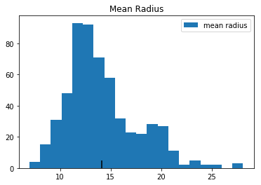


    
    
    


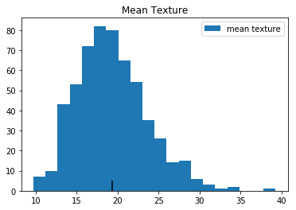


    
    
    


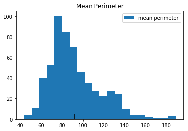


    
    
    


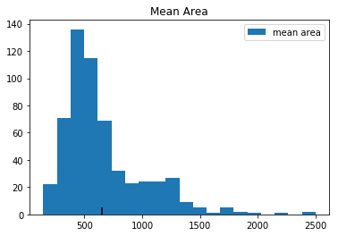


    
    
    


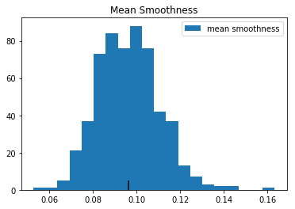


    
    
    


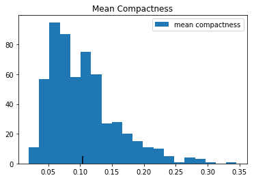


    
    
    


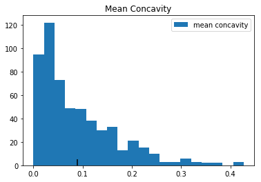


    
    
    


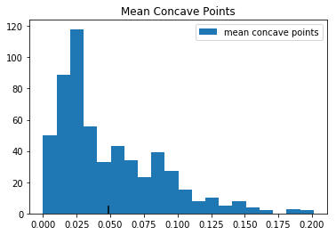


    
    
    


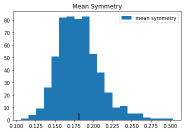


    
    
    


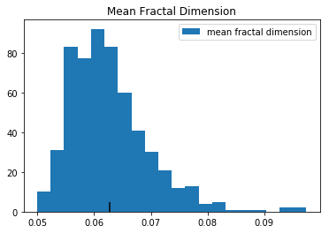


    
    
    


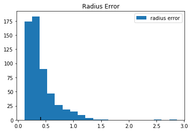


    
    
    


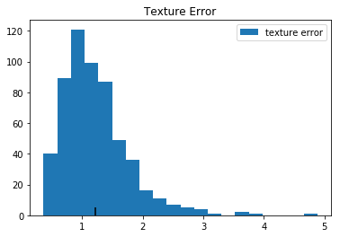


    
    
    


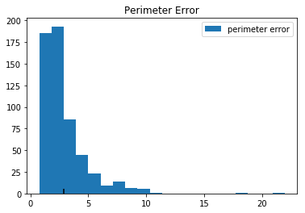


    
    
    


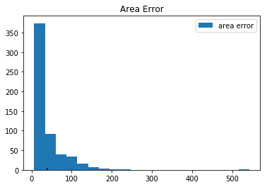


    
    
    


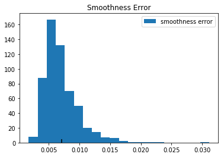


    
    
    


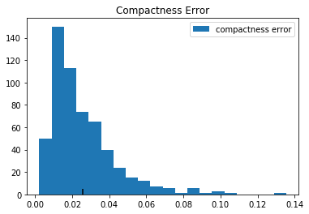


    
    
    


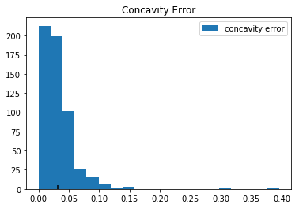


    
    
    


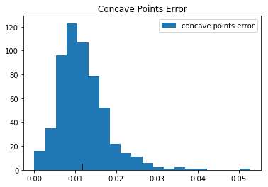


    
    
    


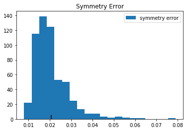


    
    
    


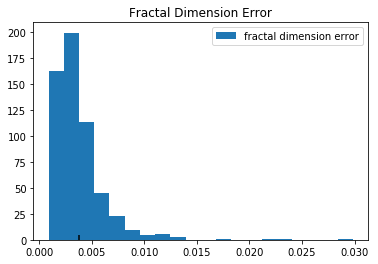


    
    
    


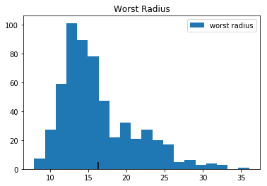


    
    
    


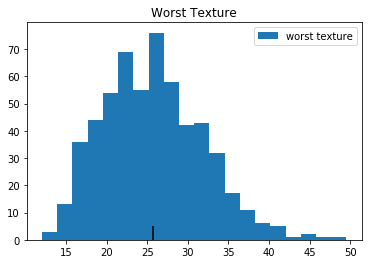


    
    
    


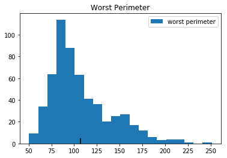


    
    
    


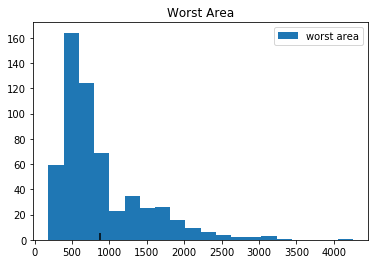


    
    
    


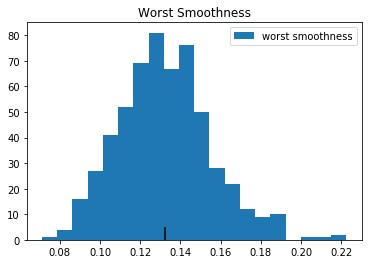


    
    
    


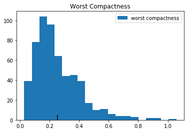


    
    
    


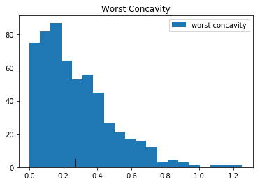


    
    
    


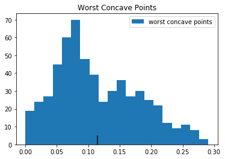


    
    
    


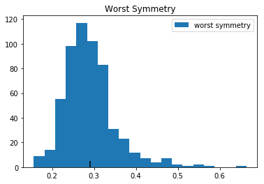


    
    
    


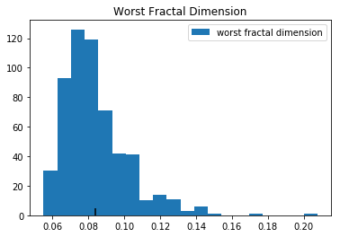


    
    
    


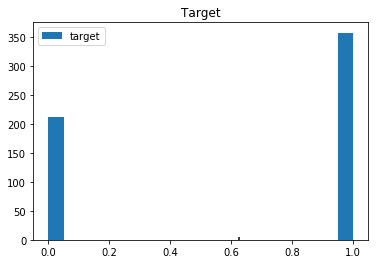


    
    
    


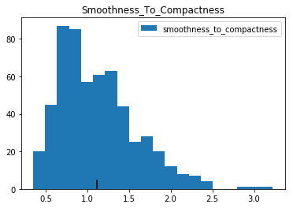


    
    
    
    Error in callback <function install_repl_displayhook.<locals>.post_execute at 0x11630e048> (for post_execute):


    ---------------------------------------------------

    KeyboardInterrupt Traceback (most recent call last)

    ~/anaconda3/envs/flatiron-env/lib/python3.6/site-packages/matplotlib/pyplot.py in post_execute()
        147             def post_execute():
        148                 if matplotlib.is_interactive():
    --> 149                     draw_all()
        150 
        151             # IPython >= 2


    ~/anaconda3/envs/flatiron-env/lib/python3.6/site-packages/matplotlib/_pylab_helpers.py in draw_all(cls, force)
        134         for f_mgr in cls.get_all_fig_managers():
        135             if force or f_mgr.canvas.figure.stale:
    --> 136                 f_mgr.canvas.draw_idle()
        137 
        138 atexit.register(Gcf.destroy_all)


    ~/anaconda3/envs/flatiron-env/lib/python3.6/site-packages/matplotlib/backend_bases.py in draw_idle(self, *args, **kwargs)
       2053         if not self._is_idle_drawing:
       2054             with self._idle_draw_cntx():
    -> 2055                 self.draw(*args, **kwargs)
       2056 
       2057     def draw_cursor(self, event):


    ~/anaconda3/envs/flatiron-env/lib/python3.6/site-packages/matplotlib/backends/backend_agg.py in draw(self)
        431             # if toolbar:
        432             #     toolbar.set_cursor(cursors.WAIT)
    --> 433             self.figure.draw(self.renderer)
        434             # A GUI class may be need to update a window using this draw, so
        435             # don't forget to call the superclass.


    ~/anaconda3/envs/flatiron-env/lib/python3.6/site-packages/matplotlib/artist.py in draw_wrapper(artist, renderer, *args, **kwargs)
         53                 renderer.start_filter()
         54 
    ---> 55             return draw(artist, renderer, *args, **kwargs)
         56         finally:
         57             if artist.get_agg_filter() is not None:


    ~/anaconda3/envs/flatiron-env/lib/python3.6/site-packages/matplotlib/figure.py in draw(self, renderer)
       1473 
       1474             mimage._draw_list_compositing_images(
    -> 1475                 renderer, self, artists, self.suppressComposite)
       1476 
       1477             renderer.close_group('figure')


    ~/anaconda3/envs/flatiron-env/lib/python3.6/site-packages/matplotlib/image.py in _draw_list_compositing_images(renderer, parent, artists, suppress_composite)
        139     if not_composite or not has_images:
        140         for a in artists:
    --> 141             a.draw(renderer)
        142     else:
        143         # Composite any adjacent images together


    ~/anaconda3/envs/flatiron-env/lib/python3.6/site-packages/matplotlib/artist.py in draw_wrapper(artist, renderer, *args, **kwargs)
         53                 renderer.start_filter()
         54 
    ---> 55             return draw(artist, renderer, *args, **kwargs)
         56         finally:
         57             if artist.get_agg_filter() is not None:


    ~/anaconda3/envs/flatiron-env/lib/python3.6/site-packages/matplotlib/axes/_base.py in draw(self, renderer, inframe)
       2605             renderer.stop_rasterizing()
       2606 
    -> 2607         mimage._draw_list_compositing_images(renderer, self, artists)
       2608 
       2609         renderer.close_group('axes')


    ~/anaconda3/envs/flatiron-env/lib/python3.6/site-packages/matplotlib/image.py in _draw_list_compositing_images(renderer, parent, artists, suppress_composite)
        139     if not_composite or not has_images:
        140         for a in artists:
    --> 141             a.draw(renderer)
        142     else:
        143         # Composite any adjacent images together


    ~/anaconda3/envs/flatiron-env/lib/python3.6/site-packages/matplotlib/artist.py in draw_wrapper(artist, renderer, *args, **kwargs)
         53                 renderer.start_filter()
         54 
    ---> 55             return draw(artist, renderer, *args, **kwargs)
         56         finally:
         57             if artist.get_agg_filter() is not None:


    ~/anaconda3/envs/flatiron-env/lib/python3.6/site-packages/matplotlib/patches.py in draw(self, renderer)
        556             renderer = PathEffectRenderer(self.get_path_effects(), renderer)
        557 
    --> 558         renderer.draw_path(gc, tpath, affine, rgbFace)
        559 
        560         gc.restore()


    ~/anaconda3/envs/flatiron-env/lib/python3.6/site-packages/matplotlib/backends/backend_agg.py in draw_path(self, gc, path, transform, rgbFace)
        169         else:
        170             try:
    --> 171                 self._renderer.draw_path(gc, path, transform, rgbFace)
        172             except OverflowError:
        173                 raise OverflowError("Exceeded cell block limit (set "


    KeyboardInterrupt: 


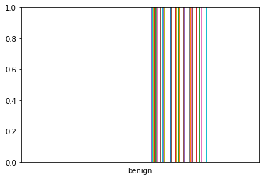


```python
# let's make a dataframe 
# list of dictionaries
dict_list = [{"name": "blake", "os": "pc"},
             {"name": "payson", "os": "pc"},
             {"name": "joan", "os": "MAC!"},
             {"name": "ari", "os": "pc"},
             {"name": "tom", "os": "pc"},
             {"name": "leighanna", "os": "MAC!"},
             {"name": "erica", "os": "MAC!"},
             {"name": "jeremie", "os": "LINUX"},
             {"name": "kaila", "os": "pc"},
             {"name": "heather", "os": "pc"},
             {"name": "edward", "os": "pc"},
             {"name": "saif", "os": "pc"},
             {"name": "brzaf", "os": "MAC!"},
             {"name": "thomas", "os": "MAC!"},
             {"joan": 1, "MAC!": 1}]
```


```python
df_students = pd.DataFrame(dict_list)
df_students
```


<div>
<style scoped>
    .dataframe tbody tr th:only-of-type {
        vertical-align: middle;
    }

    .dataframe tbody tr th {
        vertical-align: top;
    }

    .dataframe thead th {
        text-align: right;
    }
</style>
<table border="1" class="dataframe">
  <thead>
    <tr style="text-align: right;">
      <th></th>
      <th>name</th>
      <th>os</th>
      <th>joan</th>
      <th>MAC!</th>
    </tr>
  </thead>
  <tbody>
    <tr>
      <td>0</td>
      <td>blake</td>
      <td>pc</td>
      <td>NaN</td>
      <td>NaN</td>
    </tr>
    <tr>
      <td>1</td>
      <td>payson</td>
      <td>pc</td>
      <td>NaN</td>
      <td>NaN</td>
    </tr>
    <tr>
      <td>2</td>
      <td>joan</td>
      <td>MAC!</td>
      <td>NaN</td>
      <td>NaN</td>
    </tr>
    <tr>
      <td>3</td>
      <td>ari</td>
      <td>pc</td>
      <td>NaN</td>
      <td>NaN</td>
    </tr>
    <tr>
      <td>4</td>
      <td>tom</td>
      <td>pc</td>
      <td>NaN</td>
      <td>NaN</td>
    </tr>
    <tr>
      <td>5</td>
      <td>leighanna</td>
      <td>MAC!</td>
      <td>NaN</td>
      <td>NaN</td>
    </tr>
    <tr>
      <td>6</td>
      <td>erica</td>
      <td>MAC!</td>
      <td>NaN</td>
      <td>NaN</td>
    </tr>
    <tr>
      <td>7</td>
      <td>jeremie</td>
      <td>LINUX</td>
      <td>NaN</td>
      <td>NaN</td>
    </tr>
    <tr>
      <td>8</td>
      <td>kaila</td>
      <td>pc</td>
      <td>NaN</td>
      <td>NaN</td>
    </tr>
    <tr>
      <td>9</td>
      <td>heather</td>
      <td>pc</td>
      <td>NaN</td>
      <td>NaN</td>
    </tr>
    <tr>
      <td>10</td>
      <td>edward</td>
      <td>pc</td>
      <td>NaN</td>
      <td>NaN</td>
    </tr>
    <tr>
      <td>11</td>
      <td>saif</td>
      <td>pc</td>
      <td>NaN</td>
      <td>NaN</td>
    </tr>
    <tr>
      <td>12</td>
      <td>brzaf</td>
      <td>MAC!</td>
      <td>NaN</td>
      <td>NaN</td>
    </tr>
    <tr>
      <td>13</td>
      <td>thomas</td>
      <td>MAC!</td>
      <td>NaN</td>
      <td>NaN</td>
    </tr>
    <tr>
      <td>14</td>
      <td>NaN</td>
      <td>NaN</td>
      <td>1.0</td>
      <td>1.0</td>
    </tr>
  </tbody>
</table>
</div>


```python
df_students['os'].value_counts()
```


    pc       8
    MAC!     5
    LINUX    1
    Name: os, dtype: int64


### Assessment
